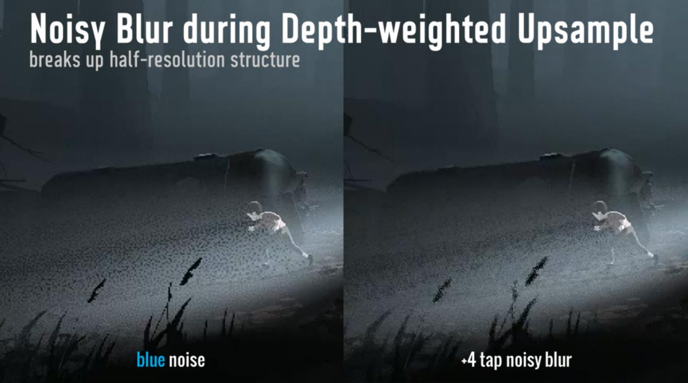
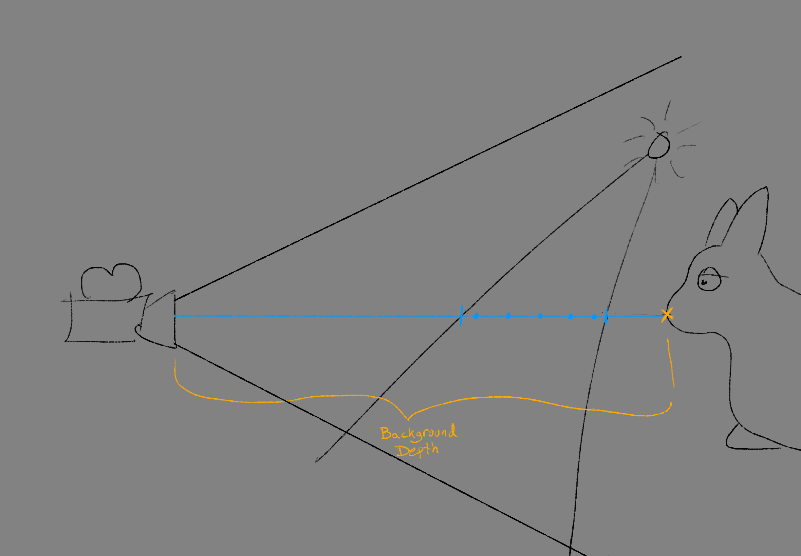
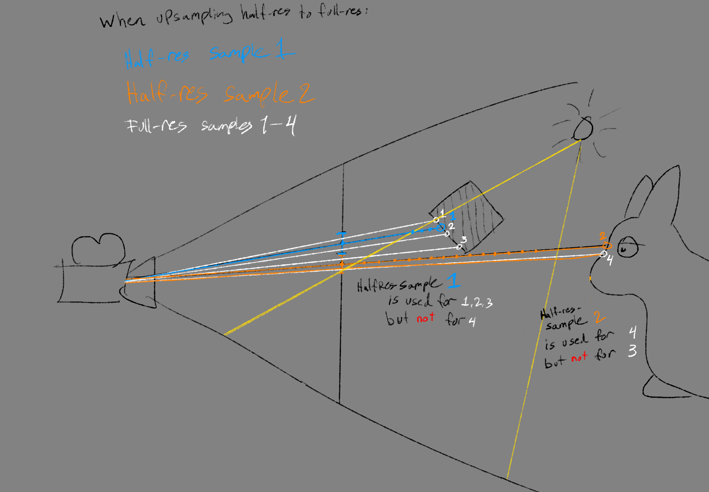

From time to time I receive questions on the depth aware upsampling mentioned in the INSIDE-rendering presentation: [https://loopit.dk/rendering_inside.pdf#page=39](https://loopit.dk/rendering_inside.pdf#page=39)



The goal of this technique is to take the texture-output from a half-resolution pass, containing the results of sampling volumetric fog -  and scale it up to full resolution. This presents two challenges:
* Making sure samples from the low-resolution buffer, do not spill on top of foreground objects in the high-resolution buffer
* Making sure the samples in the volumetric fog can be properly accumulated by TAA after upsampling

<br>

The path to arrive at a depth-aware noisy blur went along the following path:

* Version 1: Scale up the texture using ordinary (hardware) bilinear sampling which gives bleeding across things in front of the volumetrics. Boo.
* Version 2: Instead, scale up the texture using manual bilinear sampling, and test the depth of each sample (texel) and only accept samples at similar depth. This requires saving the depth of the volumetrics... which of course is really a range containing all the samples taken, but we just use the background depth at the sample-screenspace-position. Using the background depth makes sense as a heuristic to determine valid pixels: If high- and low-res saw the same background-depth, then the low-res result is probably valid.

So this solves the bleeding, but still looks like an upscaled texture. The problem we then run into is that we are running TAA afterwards, and are using it for sample accumulation (read: denoising over time). TAA only accepts pixel-values it can see in a pixel's immediate neighborhood (we are using [neighborhood-clipping](https://github.com/playdeadgames/temporal)) - and when simply upscaling a half-resolution image, the neighborhood only contains 4 differet pixels instead of the usual 9, causing the bounding-box of the seen neighborhood values to be smaller, and fewer values to be accepted. The result is half-res noisy pixels. Boo.

* Version 3: So then, to get TAA to see as many values as possible, so that across frames it will accept as many values from the volumetric-sampling as possible, we do a four sample blur, randomly picking samples around the full-resolution pixel - and test the depth for each sample so nothing bleeds on top of geometry in front. It works because the "noise" in the blur gives many different values in the TAA-neighborhood clamping, causing the TAA to accept a wider range of values from the history-buffer.

|  |  |
|------|------|
| Volumetric fog is sampled within the light, and the background depth is saved | When upsampling to a high-res pixel, low-res texels are only used if they have stored a depth similar to the depth in the position of the high-res pixel | 

Notice that the result is always a weighing of the half-res texels; "bad" pixels still contribute, just a lot less ( [https://www.desmos.com/calculator/tscldzty2f](https://www.desmos.com/calculator/tscldzty2f) ).


All in all, this works reasonably well, though I suspect there is a more accurate solution hiding in saving the range instead of the background pixel, and fade texels using that. Clearly Order Independant Transparency approaches (e.g. like [Moment-Based-Order-Independant-Transparency](https://cg.ivd.kit.edu/english/mboit.php) ) also appear to be applicable to this problem.

It is also worth noting that for INSIDE only an additive term was calculated for Volumetric lighting - which in turn was entirely uniform. It is more often the case that both irradiance and the optical depth (how much of the background was obscured by the fog) are saved.

***

The idea of checking depths while upsampling is from here: [https://www.ppsloan.org/publications/ProxyPG.pdf#page=5](https://www.ppsloan.org/publications/ProxyPG.pdf#page=5)

And the idea of noise-filled sampling is stolen from Tomas' presentation here:
[https://www.ea.com/frostbite/news/stochastic-screen-space-reflections](https://www.ea.com/frostbite/news/stochastic-screen-space-reflections)

See also the RDR2-slides that use the same method:
[https://advances.realtimerendering.com/s2019/slides_public_release.pptx](https://advances.realtimerendering.com/s2019/slides_public_release.pptx)

***

And finally the code

```hlsl
static const float M_TAU = 6.283185307,
static const float MAX_FILTERSIZ = 3.1;

//note: R is uniform, GBA is TPDF
float2 uv_bn = (vpos.xy + float2(1259,1277)*_RealTime.w) * _DitherTexUni_Size.zw;
float4 rnd = tex2Dlod( _BlueNoiseTexUniformTri, float4( uv_bn, 0, 0) );

//note: disc jitter
float s, c;
sincos ( rnd.x * M_TAU, s, c);
float2 rot = MAX_FILTERSIZ * float2(c, s);
float ofsrnd = 0.25 * rnd.y;

//note: fastSqrtNR0 from https://github.com/michaldrobot/ShaderFastLibs
float4 ofsDist = float4( fastSqrtNR0(     ofsrnd),
                         fastSqrtNR0(0.25+ofsrnd),
                         fastSqrtNR0(0.50+ofsrnd),
                         fastSqrtNR0(0.75+ofsrnd) );

float2 ofs0 = ofsDist[0] * float2( rot.x,   rot.y);
float2 ofs1 = ofsDist[1] * float2(-rot.y,   rot.x);
float2 ofs2 = ofsDist[2] * float2(-rot.x,  -rot.y);
float2 ofs3 = ofsDist[3] * float2( rot.y,  -rot.x);

//note: texel centers, [0;_VolumetricTexSize] (half resolution)
float2 uv_px = 0.5 * vpos;
float4 uv01_px = uv_px.xyxy + float4(ofs0,ofs1);
float4 uv23_px = uv_px.xyxy + float4(ofs2,ofs3);

//note: rendertarget contains R8G8B8A8
//      [R=volumetric-light-intensity, GBA=24bit packed float containing depth of background pixel]
//note: Volumetric light intensity saved squared to improve precision
float4 fogsample0 = LOAD_TEX2D_CLAMPED( _VolumetricTex, uv01_px.xy );
float4 fogsample1 = LOAD_TEX2D_CLAMPED( _VolumetricTex, uv01_px.zw );
float4 fogsample2 = LOAD_TEX2D_CLAMPED( _VolumetricTex, uv23_px.xy );
float4 fogsample3 = LOAD_TEX2D_CLAMPED( _VolumetricTex, uv23_px.zw );

//note: function to pack/unpack floats from bytes is built into Unity
float4 d = float4(  DecodeFloatFrom3PackedBytes( fogsample0.gba ),
                    DecodeFloatFrom3PackedBytes( fogsample1.gba ),
                    DecodeFloatFrom3PackedBytes( fogsample2.gba ),
                    DecodeFloatFrom3PackedBytes( fogsample3.gba ) );

//note: edge-detection
float mind = min4( d );
float maxd = max4( d );
float diffd = maxd-mind;
float avg = dot(d, float4(0.25) );
bool d_edge = (diffd/avg) < 0.1;

float atten;

//note: only necessary to sample full-resolution depth if volumetric samples were on a depth-edge
if ( d_edge )
{
    float4 fogAtten = float4( fogsample0.r, fogsample1.r, fogsample2.r, fogsample3.r );
    fogAtten *= fogAtten; //note: fogatten saved squared to improve precision
    atten = 0.25 * fogAtten;
}
else
{
    float2 bguv = vpos.xy;
    float bgdepth = Linear01Depth( UNITY_SAMPLE_DEPTH( LOAD_TEX2D(_CameraDepthTexture, bguv) ) );

    //note: depth weighing from https://www.ppsloan.org/publications/ProxyPG.pdf#page=5
    float4 dd = abs( d - float4(bgdepth) );
    float4 w = float4(1.0) / (dd + float4(0.00001));
    float sumw = w.x + w.y + w.z + w.w;

    float4 fogAtten = float4( fogsample0.r, fogsample1.r, fogsample2.r, fogsample3.r );
    fogAtten *= fogAtten; //note: fogatten saved squared to improve precision
    atten = dot( w, fogatten ) / sumw;
}

float3 outcol = atten * _FogLightColor.rgb;
outcol += (2.0*rnd.gba-1.0) / 255.0; //note: 8bit tpdf dithering
```
