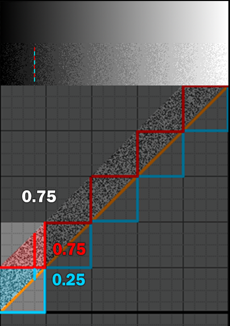

# Removing Banding in Linelight
<p style="text-align:right;"><i>2022-01-22</i></p>

**TL;DR** If your game has banding, it is often very easy to get rid of simply by adding noise to the shader-outputs:

| <center>Bandy Linelight</center> | <center>Beautiful Linelight</center> |
|-------------------------|------------------------|
|  |   |


# Intro - Linelight

Linelight is a magnificient puzzlegame with a beautiful artstyle. [You should go play it!](https://linelightgame.com/) The contrast between the sharp, focused gameplay-layer and the soft background makes for an appealing and functional aesthetic.

Having severe banding-PTSD from working on [INSIDE](https://playdead.com/games/inside/), it always felt like the elegant artstyle of Linelight was disrupted by the sharp edges caused by banding. So when I had the good fortune to get to work with [the creator](https://www.youtube.com/watch?v=OY6fnDVYKiw), and after an indecent amount of pestering on my part, he gratiously allowed me a few hours in the company of the sourcecode of the game.

As the visuals of the game are fairly simple, I thought it would be a nice example to explain how little it takes to remove the banding-artefact otherwise common in many games, and what impact it can have visually.

> A quick note that we are looking at Unity 2020.1.0f1 using the built-in render-pipeline


<br>

# Removing Banding in Unity's Built-In Sprite Renderer

All of Linelight is rendered using the SpriteRenderer in Unity. This means that, while the game-project does not explicitly contain shaders, all shapes are rendered with the same built-in shader:

```hlsl
//note: Sprites-Default.shader
fixed4 SpriteFrag(v2f IN) : SV_Target
{
  fixed4 c = SampleSpriteTexture (IN.texcoord) * IN.color;
  c.rgb *= c.a;
  return c;
}
```
Which we replace with the following (all of which we will dive into in the article below, but here it is because everyone loves spoilers and copy-pasting code):
```hlsl
//note: uniform pdf rand [0;1[
float4 hash43n(float3 p)
{
    p  = frac(p * float3(5.3987, 5.4421, 6.9371));
    p += dot(p.yzx, p.xyz  + float3(21.5351, 14.3137, 15.3247));
    return frac(float4(p.x * p.y * 95.4307, p.x * p.y * 97.5901, p.x * p.z * 93.8369, p.y * p.z * 91.6931 ));
}

fixed4 SpriteFrag(v2f IN) : SV_Target
{
    float4 c = SampleSpriteTexture (IN.texcoord) * IN.color;
    c.rgb *= c.a; //note: premultiplied alpha

    //note: color dithering
    float4 r0f = hash43n( float3(IN.texcoord, fmod(_Time.y, 1024.0)) );
    float4 rnd = r0f - 0.5; //symmetric rpdf
    float4 t = step( 0.5/255.0, c) * step( c, 1.0-0.5/255.0 );
    rnd += t * (r0f.yzwx - 0.5); //symmetric tpdf

    const float4 target_dither_amplitude = float4(1.0, 1.0, 1.0, 10.0);
    float4 max_dither_amplitude = max( 1.0/255.0, min( c, 1.0-c ) ) * 255.0;
    float4 dither_amplitude = min( float4(target_dither_amplitude), max_dither_amplitude );
    rnd *= dither_amplitude;

    c += rnd / 255.0;

    return fixed4( c );
}
```

<br>

# Four Easy Steps to Banding-Free Bliss

Removing banding in Linelight pretty much came down to
1. Downloading the [built-in-shaders from Unity](https://unity3d.com/get-unity/download/archive)
2. Making a copy of the used shader (`Sprites-Default.shader`)
3. Inserting code in the shader-copy, to *add noise* to the color before output.
4. Creating and assigning the material to all sprite-renderers

| <center>Before<br>(using default material `Sprites-Default`)</center> | <center>After<br>(custom material `mdz_Sprites_Default`)</center> |
|------------------------------------------------------|--------------------------------------------------|
|                           |                         |

That's it. That is the article.

<br>

# Back up, tell me Everything: How does adding noise to an otherwise beautiful image help?

The human eye is really good at distinguishing details in dark areas - evolution-wise it rather helps with not getting eaten by creatures lurking in the dark. We can perceive quite a bit more than the 8bits/channel often used in rendering (somewhere around 14bits) - and as the human vision-system is also great at finding edges, the abrupt color-changes caused by banding in dark areas is quite noticeable to us. Conversely, our perceptual system is very robust against noise in dark areas, which we barely notice - probably because it occurs naturally in low-light conditions, and rarely eats us.

Color-banding is caused by numbers being quantized to lower precision integers - i.e. rounded to nearest integer (in rendering typically 8bit integers for each color-channel, so 32bit-RGBA = R8+G8+B8+A8). There is no way around turning color-values into integers. However, by adding noise per pixel we *can* make sure that, no matter the precision, we see the right value *on average*, while also breaking up the noticeable banding-edges and replace them with unnoticable noise.

| <center>Signal quantized<br>(signal in orange, quantized signal in blue)</center> | <center>Noise added to Signal before quantization</center> |
|-----------------------------------------------------------------------------------|------------------------------------------------------------------------------------------------------|
|                                                           |                                                                               |
| <center><i>a smooth input turns into a staircase due to conversion to integers</i></center> | <center><i>adding noise, the integers now vary between Too Much and Too Little</i><br><i>(on average, we now hit the original signal)</i></center> |

*Interactive version below (drag line with mouse, white point marks average across 32 random values)*

<div><div style="position:relative;padding-top:56.25%;"><iframe src="https://www.shadertoy.com/embed/7lyXWt?gui=true&t=0&paused=false&muted=true" frameborder="1" allowfullscreen="true" style="position:absolute;top:0;left:0;width:100%;height:100%"></iframe></div></div>

Read [here](https://loopit.dk/banding_in_games.pdf) and [here](https://loopit.dk/rendering_inside.pdf) for more details on banding.

In order to generate the noise used for dithering, we will be using the following hash-function because it is fast and GoodEnough(TM) ([go here](http://www.jcgt.org/published/0009/03/02/) for a rigorous analysis of hash-functions on GPUs). It takes a 3-component input (say screenposition.xy and time), and calculates four pseudo-random values which we will use to dither RGBA independently:

```hlsl
//note: uniform pdf rand [0;1[
float4 hash43n(float3 p)
{
    p  = frac(p * float3(5.3987, 5.4421, 6.9371));
    p += dot(p.yzx, p.xyz  + float3(21.5351, 14.3137, 15.3247));
    return frac(float4(p.x * p.y * 95.4307, p.x * p.y * 97.5901, p.x * p.z * 93.8369, p.y * p.z * 91.6931 ));
}
```

Removing banding is then achieved by simply adding noise to the output of our shader, in the case of Linelight, our copy of the `Sprites-Default`-shader:

```hlsl
fixed4 SpriteFrag(v2f IN) : SV_Target
{
  fixed4 c = SampleSpriteTexture (IN.texcoord) * IN.color;
  c.rgb *= c.a;

  //note: add RGB-noise to dither color
  float4 rnd = hash43n( float3(IN.texcoord.xy, _Time.y) ); //note: uniform noise [0;1[
  c += (rnd.xyzw+rnd.yzwx-1.0) / 255.0; //note: symmetric tpdf noise 8bit, [-1;1[

  return c;
}
```
(for reasons bordering magic, you should use a [noise with a triangular distribution and an amplitude of 2LSB](https://www.youtube.com/watch?v=RdN06E6Xn9E&t=20m25s) (Least Significant Bit) - which luckily is easily obtained by simply adding two random-numbers together, like here where we add different components of the calculated hash-values. In the above illustrations we used 1LSB noise with a uniform distribution, which is why there are vertical bands with no noise visible in the dithered gradients)

| <center>no dithering on large white-sprite (noticeable banding)<br>(image contrast increased)</center> | <center>rgb dithering (some subtle banding)<br>(image contrast increased)</center> |
|-------------------------------------------------------------------------------------------------------|-----------------------------------------------------------------------------------|
|                                                                        |                                  |


<br>

## Blacks and whites should not change

Since the output is clamped to [0;255] upon write to the rendertarget, we need to limit the amplitude of the noise used for dithering, to not add noise to pure blacks and whites (more in depth treatment [here](https://computergraphics.stackexchange.com/questions/5904/whats-a-proper-way-to-clamp-dither-noise/5952#5952)). Another way to think about this, is that the average of the dithered signal should always be equal to the signal itself.

```hlsl
fixed4 SpriteFrag(v2f IN) : SV_Target
{
    fixed4 c = SampleSpriteTexture (IN.texcoord) * IN.color;
    c.rgb *= c.a;

    //note: color dithering
    float4 r0f = hash43n( float3(IN.texcoord, fmod(_Time.x, 1024.0)) );
    float4 rnd = r0f - 0.5; //symmetric rpdf
    float4 t = step(0.5/255.0,c) * step(c,1.0-0.5/255.0); //note: comparison done per channel
    rnd += t * (r0f.yzwx - 0.5); //symmetric tpdf
    c += rnd / 255.0;

    return c;
}
```

<br>

| <center>triangular PDF<br>(notice the average signal in yellow diverges at the ends, and blacks/whites are noisy)</center> | <center>triangular PDF, noise switch to 1LSB rpdf noise at boundaries<br>(issue at both ends fixed)</center> |
|----------------------------------------------------------------------------------------------------------------------------|-------------------------------------------------------------------------------------|
|  |  |

<center><i>zoom or open image in new tab to see details</i> </center>

<br>

# Blending

When rendering sprites on top of each other, they are blended - which means the GPU will render one sprite to the rendertarget - then render the next sprite, read back the color in the rendertarget, do a blending operation like `(1-alpha)*dst_col + alpha*src_col` - and then write the result to the rendertarget.

Ideally, what we would want to do is to first blend then add noise like so: `(1-t)*dst + t*src + noise` - all at high precision. We could potentially achieve this by doing the `t*src` in the shader, then add noise just before the output. Unfortunately [directx specifies](https://microsoft.github.io/DirectX-Specs/d3d/archive/D3D11_3_FunctionalSpec.htm#17.5%20Blending%20Precision) that colors can be reduced to rendertarget precision _before_ blending. This means our noise also [gets quantized](https://loopit.dk/banding_in_games.pdf#page=52) removing its dithering effect. Don't worry if this all sounds a bit hairy - our workaround is to simply add noise to the alpha-channel:

| <center>rgb only dithering (some subtle banding)<br>(image contrast increased)</center> | <center>full rgba-dithering<br>(image contrast increased)</center> |
|----------------------------------------------------------------------------------------|-------------------------------------------------------------------|
|  |  |

We need to add more noise to alpha than to RGB. In the above example around 10x was "enough" (in INSIDE it was adjusted for each transparent object). It is not generally possible to get it perfect for every pixel, so you tend to have to error on the side of Too Much Noise. It is worth noting that even the simple solution of "adding more noise" is not entirely trivial, as we risk adding so much noise that we noticeably ruin pure blacks/whites:

| <center>notice large unsightly square<br>(image contrast increased)</center> |
|-------------------------------------------------------------------------------------------|
|                                                                |


So to solve this we again change the amplitude of the noise to increase the amount of noise, while still limiting it at the boundaries, so blacks and whites remain noise-free.

```hlsl
const float4 target_dither_amplitude = float4(1.0, 1.0, 1.0, 10.0);
float4 max_dither_amplitude = max( 1.0/255.0, min( c, 1.0-c ) ) * 255.0;
float4 dither_amplitude = min( float4(target_dither_amplitude), max_dither_amplitude );
rnd *= dither_amplitude;
```

<br>

| <center>triangular PDF with large amplitude noise</center> | <center>triangular PDF, noise amplitude limited to remove clamping</center> |
|------------------------------------------------------------|-----------------------------------------------------------------------------|
|                            |   |

<center><i>zoom or open image in new tab to see details</i> </center>
<br>

| <center>notice large unsightly square around player<br>(image contrast increased)</center> | <center>square is gone now that we have restricted the noise<br>(image contrast increased)</center> |
|-------------------------------------------------------------------------------------------|----------------------------------------------------------------------------------------------------|
|                                                                |  |


This leads us to the **final shader-code**, again, for our custom `Sprites/Default`, both forcing pure blacks/whites by limiting to an rpdf-noise where clamping occours AND increasing noise (but not "too much"):
```hlsl
fixed4 SpriteFrag(v2f IN) : SV_Target
{
    float4 c = SampleSpriteTexture (IN.texcoord) * IN.color;
    c.rgb *= c.a; //note: premultiplied alpha

    //note: color dithering
    float4 r0f = hash43n( float3(IN.texcoord, fmod(_Time.y, 1024.0)) );
    float4 rnd = r0f - 0.5; //symmetric rpdf
    float4 t = step( 0.5/255.0, c) * step( c, 1.0-0.5/255.0 );
    rnd += t * (r0f.yzwx - 0.5); //symmetric tpdf

    const float4 target_dither_amplitude = float4(1.0, 1.0, 1.0, 10.0);
    float4 max_dither_amplitude = max( 1.0/255.0, min( c, 1.0-c ) ) * 255.0;
    float4 dither_amplitude = min( float4(target_dither_amplitude), max_dither_amplitude );
    rnd *= dither_amplitude;

    c += rnd / 255.0;

    return fixed4( c.rgb, c.a );
}
```

# A Quick Note on Banding in Source Textures

Most of the source-content in Linelight is made with 24bit rgb-images rendered as sprites, which can contain banding already in the source material. There is no easy way to remedy this after the fact, so the easiest approach is to fix the content. The way to fix it, depends on the cause:
- If caused by texture-compression in Unity
    - The default in Unity is to use compression. There is no magic wand here, just change compression-settings on the image to do less of it (it is a setting on the texture in Unity)
- If caused during authoring
    - use higher precision source images (e.g. 16bit). This is absolutely dobable, but of course comes with a performance-cost. Incidentally, this plugin for Photoshop turned out to be excellent https://www.exr-io.com/
    - add noise to source images
        - noise in images can of course not be animated, so is more noticable :(
        - the images are scaled so noise becomes scaled and visible :(
    - for Linelight, most sprite-images are simply radial gradients, so we could approximate with procedural shapes (i.e. write a shader that renders a radial gradient...)

# A Quick Note on the Type of Noise Used

While this article is dithering using uniform random noise ("white noise") because it gives a natural look, you are entirely free to use [whatever type of pattern you like](http://danfessler.com/blog/hd-index-painting-in-photoshop):

[](http://danfessler.com/blog/hd-index-painting-in-photoshop)

I also wouldn't be able to look the rest of [the Blue Noise Brigade](https://twitter.com/P_Malin/status/1320681619150249984) in the eye, if I didn't at least made a reference to the splendords achieveable by simply exchanging the noise-pattern used for dithering, with [blue noise](https://gist.github.com/pixelmager/5d25fa32987273b9608a2d2c6cc74bfa) - making the noise a lot less perceivable simply by exchanging the dither-pattern:

| White- vs Blue-noise for dithering  |
|---------------|
| [](white_vs_blue.png) |
| <center><i>notice how the noise at the bottom looks much smoother due to less "clumping"<br><a href="https://www.shadertoy.com/view/NdSyzz">shadertoy</a></i></center> |


# References

Congratulations for making it this far - if you want to dive further into the topic, please explore the links below, and don't hesistate to [reach out](https://twitter.com/pixelmager) if you have any questions.

Links directly relating to the article
- Linelight the Game [https://linelightgame.com/](https://linelightgame.com/)
- Shaders used for illustrations
  - [https://www.shadertoy.com/view/WddfW2](https://www.shadertoy.com/view/WddfW2)
  - [https://www.shadertoy.com/view/XlfBRB](https://www.shadertoy.com/view/XlfBRB)
  - [https://www.shadertoy.com/view/7lyXWt](https://www.shadertoy.com/view/7lyXWt)
- All the random functions your GPU can eat: [Hash Functions for GPU Rendering](https://jcgt.org/published/0009/03/02/)
- A bunch of presentations, too many of which are on dithering [https://loopit.dk/publications/](https://loopit.dk/publications/)

More info on banding and dithering
- [Gjoel, 2014: Banding in Games](https://loopit.dk/banding_in_games.pdf)
- [Wronski, 2016: Dithering in Games - a mini series](https://bartwronski.com/2016/10/30/dithering-in-games-mini-series/)
- [Smith, 2007: Gamma Through the Rendering Pipeline](https://loopit.dk/archive/Gamma_Through_the_Rendering_Pipeline.zip)
- [Mittring 2018, Oculus Tech Note: Shader Snippets for Efficient 2D Dithering](https://developer.oculus.com/blog/tech-note-shader-snippets-for-efficient-2d-dithering/)
- [Lottes, 2016: Advanced Techniques and Optimization of ~~HDR~~ VDR Color Pipelines](https://gpuopen.com/wp-content/uploads/2016/03/GdcVdrLottes.pdf)
- [Lottes, 2016: The Fine Art of Film Grain](https://gpuopen.com/learn/vdr-follow-up-fine-art-of-film-grain/)
- [Wolfe, 2017: Animating Noise for Integrating over Time](https://blog.demofox.org/2017/11/03/animating-noise-for-integration-over-time-2-uniform-over-time/)
