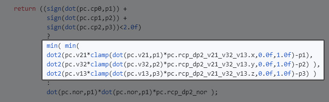

# Straight Forward SIMD-Optimisation

**TODO: handle all todos ;D**

### TL;DR
Do what Mike, Andreas and Daniel says and your embarrasingly parallel algorithm will scale well across SIMD as well as cores...

"Stupid code parallelizes well" - Peter Andreasen

# Introduction
So I read [this great blog-post](https://kosmonautblog.wordpress.com/2017/05/01/signed-distance-field-rendering-journey-pt-1/) on Signed Distance Fields and all the awesome things you can do with them - and stumbled upon this bit on how to calculate SDFs from a triangular mesh:
> The speed up is crazy. Here is the debug output for a 50x50x50 SDF of our tiger, once done on GPU and once done with 4 CPU threads.
>
> SDF generated in 2ms on GPU
>
> SDF generated in 60610ms with 4 thread(s)

That is quite the speed-up, so big it left me wondering if the CPU-version could be optimized more... and since I needed a meshToSDF-converter anyway, and you don't encounter a trivially SIMDable problem every day, I dug myself into this futile optimisation-problem for the hell of it, knowing very well that the best approach would most likely be an approximate GPU-based solutions ([claybook](https://www.dropbox.com/s/s9tzmyj0wqkymmz/Claybook_Simulation_Raytracing_GDC18.pptx?dl=0#) / [tressfx](https://github.com/GPUOpen-Effects/TressFX/blob/master/amd_tressfx/src/Shaders/TressFXSDFCollision.hlsl) / [Geometry3Sharp](https://github.com/gradientspace/geometry3Sharp/blob/master/spatial/MeshSignedDistanceGrid.cs) ).

But who cares about practicalities, let's dig in...
```
All tests are run on a i9-7980XE with 64GB DDR4 RAM (win10, Visual Studio 2017.x).
(18cores/36threads@2.6-4.2GHz, 1MB/core L2$, and 24.75MB L3$ shared between cores)
Unrealistically, we do not worried about compatibilty, but frivolously use any feature of the CPU we find useful useful. The test-object is the Tiger.obj from the linked article, sampled at 64^3 gridcells, taking the median of 7 runs.
```
Also, code has been simplified a bit here, check out the [full source on GitHub](https://github.com/pixelmager/MeshToSDF).

# Base Code
This is the problem:
For each grid-cell in a 3D array, calculate the minimum distance to a triangle-mesh. This should give us something like

*TODO: explain data-independency*

| grid and mesh-triangles | 2D slice of evaluated 3D (unsigned) distance to bunny TODO |
|--|--|
|  |  |

There are a great number of [complications in doing this for real-world meshes with self-intersections, holes](http://citeseerx.ist.psu.edu/viewdoc/download?doi=10.1.1.480.140&rep=rep1&type=pdf) etc, which we will entirely disregard here, as we are only focused on the exciting field of optimisation.

Calculating the distance to a triangle can be done [like this](https://github.com/pixelmager/MeshToSDF/blob/master/src/evaluators/eval_bruteforce.h#L10) (again, same function used on the kosmonaut-blogpost):
```glsl
//note: from http://iquilezles.org/www/articles/triangledistance/triangledistance.htm
float dot2( in vec3 v ) { return dot(v,v); }
float udTriangle( in vec3 v1, in vec3 v2, in vec3 v3, in vec3 p )
{
    // prepare data
    vec3 v21 = v2 - v1; vec3 p1 = p - v1;
    vec3 v32 = v3 - v2; vec3 p2 = p - v2;
    vec3 v13 = v1 - v3; vec3 p3 = p - v3;
    vec3 nor = cross( v21, v13 );

    return sqrt( // inside/outside test    
                 (sign(dot(cross(v21,nor),p1)) + 
                  sign(dot(cross(v32,nor),p2)) + 
                  sign(dot(cross(v13,nor),p3))<2.0) 
                  ?
                  // 3 edges    
                  min( min( 
                  dot2(v21*clamp(dot(v21,p1)/dot2(v21),0.0f,1.0f)-p1), 
                  dot2(v32*clamp(dot(v32,p2)/dot2(v32),0.0f,1.0f)-p2) ), 
                  dot2(v13*clamp(dot(v13,p3)/dot2(v13),0.0f,1.0f)-p3) )
                  :
                  // 1 face    
                  dot(nor,p1)*dot(nor,p1)/dot2(nor) );
}
```

```c
for ( int32_t z=0,zn=sdf.header.dim_z; z<zn; ++z ) {
for ( int32_t y=0,yn=sdf.header.dim_y; y<yn; ++y ) {
for ( int32_t x=0,xn=sdf.header.dim_x; x<xn; ++x )
{
    float32_t d_min =  FLT_MAX;

    vec3_t p_nm = vec3_t( ((float32_t)(x)+0.5f) / (float32_t)xn),
                          ((float32_t)(y)+0.5f) / (float32_t)yn),
                          ((float32_t)(z)+0.5f) / (float32_t)zn) );
    vec3_t p = bb.mn + bb_range * p_nm;

    for ( size_t idx_tri=0, num_tris=mesh->tri_indices.size()/3; idx_tri<num_tris; ++idx_tri )
    {
        vec3_t &p0 = positions[ mesh->tri_indices[ 3*idx_tri+0 ] ];
        vec3_t &p1 = positions[ mesh->tri_indices[ 3*idx_tri+1 ] ];
        vec3_t &p2 = positions[ mesh->tri_indices[ 3*idx_tri+2 ] ];

        d_min = min( d_min, udTriangle( p0, p1, p2, p ) );
    }
    int idx = x + y*xn + z*xn*yn;
    sdf.data[idx] = d_min;
}}}
```
Running this code to sample the distance to a mesh at the center of each cell in a 64x64x64 grid, runs on a single thread in **20031ms**.

*TODO: callstack-profile to verify bottleneck*

Notice at this point, that there are no dependencies between loop-iterations; all triangles are traversed for each grid-cell, resulting in a single output, the distance to the closest triangle.

We can do the optimisations proposed by IQ in his article, postponing the `sqrt()` and precalculating as much data as possible, which is essentially anything not directly depending on the input position `p`:

*TODO:link to git-line*
```c
struct tri_precalc_t
{
    vec3_t v1, v2, v3;    //note: positions
    vec3_t v21, v32, v13; //note: v2-v1...
    vec3_t nor;
    vec3_t cp0, cp1, cp2; //note: cross-products
    float32_t rcp_dp2_v21, rcp_dp2_v32, rcp_dp2_v13; //note: 1/dot2(v21)...
    float32_t rcp_dp2_nor;
};
float32_t udTriangle_sq_precalc( vec3_t &p,  tri_precalc_t &pc )
{
    vec3_t p1 = p - pc.v1;
    vec3_t p2 = p - pc.v2;
    vec3_t p3 = p - pc.v3;

    return ((sign(dot(pc.cp0,p1)) + 
             sign(dot(pc.cp1,p2)) + 
             sign(dot(pc.cp2,p3))<2.0f) 
             ?
             min( min( 
             dot2(pc.v21*clamp(dot(pc.v21,p1)*pc.rcp_dp2_v21_v32_v13.x,0.0f,1.0f)-p1),
             dot2(pc.v32*clamp(dot(pc.v32,p2)*pc.rcp_dp2_v21_v32_v13.y,0.0f,1.0f)-p2) ),
             dot2(pc.v13*clamp(dot(pc.v13,p3)*pc.rcp_dp2_v21_v32_v13.z,0.0f,1.0f)-p3) )
             :
             dot(pc.nor,p1)*dot(pc.nor,p1)*pc.rcp_dp2_nor );
}
```
This gets us down to **10610ms** including the precalc, which runs in x0.52 the runtime (or x1.9 "faster"). Note that we are saving the position directly in the pre-calculated data, which is then accessed entirely linear, whereas before we were doing scattered reads of vertex-positions due to the indexed lookup into the mesh-positions. This improves the cache-performance, though we are reading more data from memory as there is no vertex-reuse. Of course, with the pre-calculated data, we are already reading a lot more data:

| tiger.obj, 2876tris, 64^3 | total size of precalculated data  | loaded memory per gridcell | notes |
|:--------------------------|:----------------------------------|--------:|----------|
| bruteforce                | `3*num_tris*(sizeof(uint32_t)+sizeof(vec3_t))` |  138192B | scattered access, smaller working-set due to vertex-reuse |
| precomputed               | `3*num_tris*sizeof(tri_precalc_t)` | 1173408B | linear access |

- roughly x8 the memory, but still well below the size of the CPU L2-cache, so effectively we are never hitting actual memory-loads, as the data stays no chip after calculation.

Note that we are outputting `64^3 float32s` so 1048576B (exactly 1MB), also written entirely linearly.

# Naïve vector-SIMD
We can directly convert the precalc code to SIMD, moving each `vec3` directly into an SSE vector `__m128`, which is a 128bit structure containing 4x`float32_t`. To assure aligned loads, we also convert the precalculated data into SIMD (we could have padded the data manually as well). For the sake of brievety, let us just focus on this piece of the code:



To illustrate the conversion-process, we start by separating out each temporary variable

```c
__m128 udTriangle_sq_precalc( vec3_t &p, tri_precalc_t &pc )
{
    // ...
    float32_t dp4 = dot(pc.v21, p1);
    float32_t dp5 = dot(pc.v32, p2);
    float32_t dp6 = dot(pc.v13, p3);

    vec3_t mul012 = vec3_t( dp4, dp5, dp6 ) * pc.rcp_dp2_v21_v32_v13;
    mul012 = clamp( mul012, 0.0f, 1.0f );

    vec3_t sub0 = pc.v21 * mul012.x - p1;
    vec3_t sub1 = pc.v32 * mul012.y - p2;
    vec3_t sub2 = pc.v13 * mul012.z - p3;

    float32_t lensq0 = dot2(sub0);
    float32_t lensq1 = dot2(sub1);
    float32_t lensq2 = dot2(sub2)
    float32_t res = min( lensq0, min(lensq1, lensq2) );
    //...
}
```
\- this can the be converted immediately to SIMD:

*TODO: link to git-line*

```c
__m128 udTriangle_sq_precalc_SIMD_aos( __m128 &p, tri_precalc_simd_aos_t &pc )
{
    // ...
    
    __m128 dp4 = _mm_dp_ps( pc.v21, p1, 0xF1); // dot(pc.v21,p1)
    __m128 dp5 = _mm_dp_ps( pc.v32, p2, 0xF1); // dot(pc.v32,p2)
    __m128 dp6 = _mm_dp_ps( pc.v13, p3, 0xF1); // dot(pc.v13,p3)

    __m128 dp456;
    dp456 = _mm_shuffle_ps( dp4, dp5, _MM_SHUFFLE(0,0,0,0) );
    dp456 = _mm_shuffle_ps( dp456, dp6, _MM_SHUFFLE(2,0,2,0) );

    __m128 mul012;
    mul012 = _mm_mul_ps( dp456, pc.rcp_dp2_v21_v32_v13 );
    mul012 = _mm_min_ps(ones, _mm_max_ps(mul012, zeros); //clamp01

    //note: packing result of dotproducts in 1 __m128 to do multiply vector-by-scalar
    __m128 mul012_x = _mm_shuffle_ps( mul012, mul012, _MM_SHUFFLE(0,0,0,0) );
    __m128 mul012_y = _mm_shuffle_ps( mul012, mul012, _MM_SHUFFLE(1,1,1,1) );
    __m128 mul012_z = _mm_shuffle_ps( mul012, mul012, _MM_SHUFFLE(2,2,2,2) );

    __m128 sub0 = _mm_fmsub_ps(pc.v21, mul012_x, p1); // dp4 * pc.v21 - p1
    __m128 sub1 = _mm_fmsub_ps(pc.v32, mul012_y, p2); // dp5 * pc.v32 - p2
    __m128 sub2 = _mm_fmsub_ps(pc.v13, mul012_z, p3); // dp6 * pc.v13 - p3

    __m128 lensq0 = _mm_dp_ps( sub0, sub0, 0xF1 ); //dot2
    __m128 lensq1 = _mm_dp_ps( sub1, sub1, 0xF1 ); //dot2
    __m128 lensq2 = _mm_dp_ps( sub2, sub2, 0xF1 ); //dot2

    res0 = _mm_min_ss( lensq0, _mm_min_ss(lensq1, lensq2) ); //note: result in f32[0]
    //...
}
```
Some notes on the resulting code:
* Being 3 dimensional points and vectors, we only ever use at most 3 of the 4 SIMD-components at a time.
* We also have to shuffle data around between actual calculations to use more than one SIMD-component for multiplications, and some parts still run only on single values and does involved stuff like horizontal sums.
* We are now evaluating both sides of the conditional and doing a select between the two. This is done in order to use only SIMD-registers, as there is a significant performance-overhead to moving in and out of SIMD-registers. *TODO: link*

This gets us down to **8265ms**, x0.79 of the time compared to the non-SIMD precalculated version (x0.42 compared to bruteforce). It is faster, but not overly impressive.

# Multiple Calculations in Parallel
Instead of trying to fit the geometric-vector calculations into SIMD, we can "transpose" the problem, and simultaneously do 4 calculations in parallel. A nice illustration of the usefulness of this approach is to do 4 dot-products in parallel (see also this [excellent presentation](https://deplinenoise.files.wordpress.com/2015/03/gdc2015_afredriksson_simd.pdf))


To futher illustrate the conversion-process, let us go through all the steps of "transposing" the calculation for 4 dot-products.

We start with a function returning dot-product of two vectors *a* and *b*:

```c
float32_t dot( vec3_t &a, vec3_t &b )
{
    return a.x*b.x +
           a.y*b.y +
           a.z*b.z;
}
```
\- removing the vec3-class and inputting the individual components directly we get
```c
float32_t dot( float32_t a_x, float32_t a_y, float32_t a_z,
               float32_t b_x, float32_t b_y, float32_t b_z )
{
    return a_x*b_x +
           a_y*b_y +
           a_z*b_z;
}
```
\- explicitly saving out the temporaries we get
```c
float32_t dot( float32_t a_x, float32_t a_y, float32_t a_z,
               float32_t b_x, float32_t b_y, float32_t b_z )
{           
    float32_t m0 = a_x*b_x;
    float32_t m1 = a_y*b_y;
    float32_t m2 = a_z*b_z;
    return m0 + m1 + m2;
}
```
This can be trivially converted to do 4 calculations at the same time by "transposing" the vectors, and packing 4 `x`, `y` and `z`-coordinates in each variable like so:
```c
vec4_t dot4( vec4_t &a_x, vec4_t &a_y, vec4_t &a_z,
             vec4_t &b_x, vec4_t &b_y, vec4_t &b_z )
{
    vec4_t m0 = a_x * b_x;
    vec4_t m1 = a_y * b_y;
    vec4_t m2 = a_z * b_z;
    return m0 + m1 + m2;
}
``` 
```c
vec4_t a_x = vec4_t(v0.x, v1.x, v2.x, v3.x);
vec4_t a_y = vec4_t(v0.y, v1.y, v2.y, v3.y);
vec4_t a_z = vec4_t(v0.z, v1.z, v2.z, v3.z);

vec4_t b_x = vec4_t(v_a.x, v_b.x, v_c.x, v_d.x);
vec4_t b_y = vec4_t(v_a.y, v_b.y, v_c.y, v_d.y);
vec4_t b_z = vec4_t(v_a.z, v_b.z, v_c.z, v_d.z);

vec4_t res = dot4( a_x, a_y, a_z,
                   b_x, b_y, b_z );
```

Which can then be directly implemented using SSE, which gets us:
```c
__m128 dot4( __m128 &a_x, __m128 &a_y, __m128 &a_z,
             __m128 &b_x, __m128 &b_y, __m128 &b_z )
{
    __m128 m0 = _mm_mul_ps( a_x, b_x );
    __m128 m1 = _mm_mul_ps( a_y, b_y );
    __m128 m2 = _mm_mul_ps( a_z, b_z );
    return _mm_add_ps( m0, _mm_add_ps( m1, m2 ) );
}
```
This can be shortened (and optimised) using FMA-instructions (where available) to combine the last two `mul` and `add`
```c
__m128 dot4_fma( __m128 &a_x, __m128 &a_y, __m128 &a_z,
                 __m128 &b_x, __m128 &b_y, __m128 &b_z )
{
    __m128 m0 = _mm_mul_ps( a_x, b_x );
    __m128 m1 = _mm_fmadd_ps( a_y, b_y, m0 );
    return _mm_fmadd_ps( a_z, b_z, m1 );
}
```

Now that we have a clear idea of how to approach doing multiple calculations at a time, we need to decide between two options:
- calculating the distance between 1 grid-cell and 4 triangles.
- calculating the distance between 4 grid-cells and 1 triangle.

## 4 Triangles vs 1 Grid Cell


To calculate the distance to 1 gridcell from 4 triangles simultaneously, we pack the same gridcell-point in all 4 components of `p_x, p_y, p_z`. At this point we re-structure our precalculated input to be SOA *TODO:link-to-github-line*

```c
//note: p_x = gridcell.xxxx etc (so same coordinate splatted to all values)
__m128 udTriangle_precalc_4tris( __m128 &p_x, __m128 &p_y, __m128 &p_z, tri_precalc_simd_soa_t *tpc, int idx_tri )
{
    // ...
    
    // dot(pc.v21,p1)
    __m128 dp4;
    {
        dp4 = _mm_mul_ps(   p1_x, pc_v21_x );
        dp4 = _mm_fmadd_ps( p1_y, pc_v21_y, dp4 );
        dp4 = _mm_fmadd_ps( p1_z, pc_v21_z, dp4 );
    }
    dp4 = _mm_mul_ps(dp4, _mm_load_ps(tpc->rcp_dp2_v21+idx_tri) );  // * pc.rcp_dp2_v21_v32_v13
    dp4 = _mm_min_ps(ones, _mm_max_ps(dp4, zeros); // clamp01
    //note: same for dp5/dp6

    // * pc.v21 - p1
    __m128 sub0_x = _mm_fmsub_ps(pc_v21_x, dp4, p1_x);
    __m128 sub0_y = _mm_fmsub_ps(pc_v21_y, dp4, p1_y);
    __m128 sub0_z = _mm_fmsub_ps(pc_v21_z, dp4, p1_z);
    //note: same for sub1/sub2

    // dot2
    __m128 lensq0;
    lensq0 = _mm_mul_ps(   sub0_x, sub0_x );
    lensq0 = _mm_fmadd_ps( sub0_y, sub0_y, lensq0 );
    lensq0 = _mm_fmadd_ps( sub0_z, sub0_z, lensq0 );
    //note: same for lensq1/lensq2

    res0 = _mm_min_ps( lensq0, _mm_min_ps(lensq1, lensq2) );
    
    // ...
}
```
* Data is loaded and processing 4 triangles at a time, naturally aligned in memory (as long as the start of the data is aligned).

This code runs in **3531ms**, x0.43 faster compared to the vector-simd version (x0.33 compared to the precomputed version).

As we are now parallelizing on triangles, we have to handle triangles not fitting in the 4\*N loop, to not miss any triangles. The simplest approach for this specific computation is to ignore the problem in the calculation, and pad the triangle-arrays with a "neutral" value, i.e. infinitely distant triangles... "neutral" values do not necessarily exist for all types of calculations, in which case the remaining values can be calculated serially (which is only a minor problem as there are necessarily few of them, less than the SIMD-size).

*TODO: how does it scale with num-triangles?*
*TODO: how does it scale with num-gridcells?*

## 1 Triangle vs 4 Grid Cells


We now look at doing the calculation in parallel for 4 grid-cells at a time, one in each SIMD-lane. This means we have to duplicate, or splat, the read triangle-data to all four components. The resulting code looks like this:

```c
#define SPLAT4_X( V ) _mm_shuffle_ps((V),(V),_MM_SHUFFLE(0,0,0,0))

__m128 udTriangle_precalc_4grid( __m128 &p_x, __m128 &p_y, __m128 &p_z, tri_precalc_simd_aos_t &pc )
{
    // ...
    
    // dot(pc.v21,p1)
    __m128 dp4;
    {
        dp4 = _mm_mul_ps(   p1_x, pc_v21_x );
        dp4 = _mm_fmadd_ps( p1_y, pc_v21_y, dp4 );
        dp4 = _mm_fmadd_ps( p1_z, pc_v21_z, dp4 );
    }
    dp4 = _mm_mul_ps(dp4, SPLAT4_X(pc.rcp_dp2_v21_v32_v13) ); // <<<<<<< added SPLAT4_X
    dp4 = _mm_min_ps(ones, _mm_max_ps(dp4, zeros); // clamp01
    //note: same for dp5/dp6

    // * pc.v21 - p1
    __m128 sub0_x = _mm_fmsub_ps(pc_v21_x, dp4, p1_x);
    __m128 sub0_y = _mm_fmsub_ps(pc_v21_y, dp4, p1_y);
    __m128 sub0_z = _mm_fmsub_ps(pc_v21_z, dp4, p1_z);
    //note: same for sub1/sub2

    // dot2
    __m128 lensq0;
    lensq0 = _mm_mul_ps(   sub0_x, sub0_x );
    lensq0 = _mm_fmadd_ps( sub0_y, sub0_y, lensq0 );
    lensq0 = _mm_fmadd_ps( sub0_z, sub0_z, lensq0 );
    //note: same for lensq1, lensq2

    res0 = _mm_min_ps( lensq0, _mm_min_ps(lensq1, lensq2) );
    //...
}
```
* When loading from the precomputed data, we do a `SPLAT4(..)` copying the triangle-data into all four lanes, to be used to calculate the four grid-points.
* The dot-products are now being calculated explicitly, and we are generally writing a lot more code
* The advantages are we have gotten entirely rid of the extra shuffles
* ...and we are utilising all four SIMD-lanes at all times.

This runs in **3125ms** - x0.9 of the time of the `4tri_1gridcell` version (x3.4 compared to precalc).

Note that we only fetch triangle-data once per 4 gridcells rather than for each cell. The downside of this is all the SPLATs, copying of triangle-inputs to SIMD-lanes - now that we have precalculated a lot of data, that is a lot of splats. We can also only concurrently evaluate grids of size 4\*N, which we will address later on.

*TODO: test directly on interleaved data instead...*

Note that we still have padding in the precomputed data.

```c
sizeof(tri_precalc_t) = 136
sizeof(tri_precalc_simd_aos_t) = 192
```

| tiger.obj, 2876tris, 64^3 | total size of precalculated data | loaded memory per gridcell | notes |
|:--------------------------|:-----------------------------------|--------:|----------|
| bruteforce   | `3*num_tris*(sizeof(uint32_t)+sizeof(vec3_t))` |  138,192B | scattered access, smaller working-set due to vertex-reuse |
| precomputed  | `3*num_tris*sizeof(tri_precalc_t)`              | 1,173,408B | linear access |
| precomputed_simd | `3*num_tris*sizeof(tri_precalc_simd_aos_t)` | 1,656,576B | linear access |
| 4 grid-cells | `3*num_tris*sizeof(tri_precalc_simd_aos_t)/4`   |  414,144B | linear access, simd-padded  |

*TODO: it's less, as replaced v12 with sub(1,2) - and 4grid-version running on interleaved data*

*TODO: how does it scale with num-triangles?*

*TODO: how does it scale with num-gridcells?*

## What about AVX?
We can of course use `__m256` to run _8_ calculations in parallel where AVX2 is available, or even `__m512` to do _16_ in parallel if the CPU has AVX512. To simplify the code, we are loading unaligned data using `_mmX_set1_ps(..)` in all cases:

*TODO: link to github-implementations*

*TODO: CPU-frequency scales down as we scale up number of SIMD-lanes, set in bios...*


| tiger.obj, 2876tris, 64^3 | method      | time(ms) | speedup |
|---------------------------|:-----------:|---------:|------|
|                           |  4grid_1tri (SSE)  |   3531ms | x1.0 (baseline) |
|                           |  8grid_1tri (AVX2) |   1860ms | x0.52 |
|                           | 16grid_1tri (AVX512) |    938ms | x0.27 |
|                           | 1grid_4tri (SSE) |   ms |  |
|                           | 1grid_8tri (AVX2) |   ms |  |
|                           | 1grid_16tri (AVX512) |  ms |  |


Parallellizing on grid-cells is close to scale optimally; doubling the number of SIMD-lanes about halves the amount of time.

# Multi-threading
As the problem trivially parallellises, we can of course also distribute it across multiple threads with little effort. A simple approach would be to split the working set on the z-axis, and assigning a z-range to each thread.


This level of granularity can obviously be an issue, e.g. using 4 threads to sample a 10^3 grid, the threads get assigned greedily `z={3,3,3,1}` items. We can then opt for a finer granularity, by e.g. mapping `index -> x,y,z` gridcells **TODO code**. We process blocks of gridcells fitting the available SIMD-size (sse->4, avx->8, avx512->16), and process the remaining `<SIMD_SIZ` elements on the main thread while the worker-threads are doing the main bulk for work. It is a bit more work to calculate the indices, but as the finer granularity allows utilising all cores, we end up with roughly the same runtime. And we can now process arbitrarily sized grids, which is handy...

*TODO: see neon-guide to ["dealing with leftovers"](https://community.arm.com/developer/ip-products/processors/b/processors-ip-blog/posts/coding-for-neon---part-2-dealing-with-leftovers?_ga=2.233747864.745029668.1572862533-821528003.1572862533)*

*TODO: image showing 1d-array of indices mapped to 3D-grid*


*TODO: explain/compare z-slice vs index->xyz*

*TODO: show profiler-timelines*

*TODO: mention 10% overhead of c++ concurrency vs own*
*TODO: test pinning threads to cores using winapi-threads?*

*TODO: plot "optimal" line*


### Tiger.obj, 2876tris, 64^3

| # threads | time *min* (ms) | time *median* (ms) | time *max* (ms) | ~poweruse (W) |
|----:|--------:|--------------:|--------------:|--------------:|
| 1   |     922 | **938** |  969 | |
| 2   |     469 | **485** |  515 | |
| 4   |     250 | **250** |  281 | |
| 8   |     125 | **140** |  141 | |
| 12  |      99 | **106** |  115 | |
| 18  |      94 | **104** |  114 | |
| 36  |      65 |  **78** |   93 | |

### Bunny.obj, 144046tris, 64^3

| # threads | time *min* (ms) | time *median* (ms) | time *max* (ms) | ~poweruse (W) |
|------------:|--------------:|--------------:|--------------:|-------------:|
| 1   |     44484 | **44875** |  45063 |  45 |
| 2   |     22687 | **23110** |  23641 |  61 |
| 4   |     11984 | **12078** |  12219 |  93 |
| 8   |      6203 |  **6235** |   6391 | 135 |
| 12  |      5015 |  **5176** |   5183 | 135 |
| 18  |      3813 |  **4005** |   4102 | 160 |
| 36  |      3032 |  **3062** |   3171 | 165 |


| Multi-Threaded Scaling | Multi-Threaded Scaling (double-logarithmic plot) |
|--------------|------------|
|  |  |

**TODO: fail, regrab images with correct number of cores...**

Again, almost "optimal" scaling, as expected.

*TODO:show microprofile-grab with precalc included*

A word on memory-layout, each thread is writing linearly to a separate part of the array. There might still be cacheline overlaps between the sequences written by each thread, but not at the same time (unless one thread just starts while another finishes).

| memory writes from 4 threads |
|---------|
|  |

# Results Overview
| tiger.obj, 2876tris, 64^3 |                                 | time(ms) | factor  |
|:--------------------------|:--------------------------------|---------:|--------:|
|                           | bruteforce                      |  20031ms | x1.0    |
|                           | precalc                         |  10610ms | x0.53   |
|                           | precalc_vector_simd             |   8265ms | x0.42   |
|                           | precalc_simd_4cells_1tri        |   3125ms | x0.16   |
|                           | precalc_simd_1cell_4tris        |   3531ms | x0.18   |
|                           | precalc_simd_16cells_1tri       |    938ms | x0.05   |
|                           | precalc_simd_16cells_1tri_mt36  |     62ms | x0.003  |
 
*TODO: graph all teh things*

# TODO: burst timings
Unity has this wonderful piece of technology called the Burst-compiler, which auto-vectorizes and -multithreads code (similar in concept to ISPC, but with C# input).
*TODO*

# Bbbut, GPUs!!
*TODO: 1080ti timings...*

*TODO: with and without precalc*

*TODO: compare directly without precalc?*

# Bbbut, approximations!
*TODO: calc narrow band of gridcells packed in SIMD-sized packets, eikonal equation from there*

*TODO: error-size? with images...*

# Bbbut, RUST! ( Hi Apoorva! :D )
*TODO: link https://bitshifter.github.io/2018/06/04/simd-path-tracing/*

# Bbbut, ISPC

# Bbbut, Fibers, better taks-scheduling, https://github.com/dougbinks/enkiTS

# Going Further...
* We are re-reading triangles per thread. The problem could possibly be re-ordered to process blocks of triangles that fit in CPU-cache in parallel across all threads.. but then that would add syncronization between the threads... and we are not generally memory-bound...
* We don't really need 32bit precision, could we convert all this to 16bit int-math and run twice as wide?

# Various Notes
Multicore-wise, we get most of the way by using C++ parallel-for, only gaining around 10% by manually threading.
*TODO: microprofile-capture-compare*
All implementations output "reasonably" the same results, though not bit-identical.
Profiled using VTune, Very Sleepy, Visual Studio Profiler and Microprofile.

# References
* https://kosmonautblog.wordpress.com/2017/05/01/signed-distance-field-rendering-journey-pt-1/
* https://kosmonautblog.wordpress.com/2017/05/09/signed-distance-field-rendering-journey-pt-2/

### On SIMD and Data-oriented design
* https://deplinenoise.files.wordpress.com/2015/03/gdc2015_afredriksson_simd.pdf
* http://www.dice.se/wp-content/uploads/2014/12/Introduction_to_Data-Oriented_Design.pdf
* http://www.cs.uu.nl/docs/vakken/magr/2017-2018/files/SIMD%20Tutorial.pdf
* https://zeux.io/2019/02/17/flavors-of-simd/

### On CPUs and caches
* https://en.wikichip.org/wiki/intel/core_i9/i9-7980xe
* https://www.intel.com/content/www/us/en/products/processors/core/6th-gen-x-series-datasheet-vol-1.html


### In General on Distance Fields
* https://rainbow.ku.dk/training/scientific-training-i/exercises/DistanceFields.pdf
* http://run.usc.edu/signedDistanceField/XuBarbicSignedDistanceField2014.pdf
* https://developer.nvidia.com/gpugems/GPUGems3/gpugems3_ch34.html
* http://citeseerx.ist.psu.edu/viewdoc/download?doi=10.1.1.480.140&rep=rep1&type=pdf
* http://citeseerx.ist.psu.edu/viewdoc/download?doi=10.1.1.107.9173&rep=rep1&type=pdf
